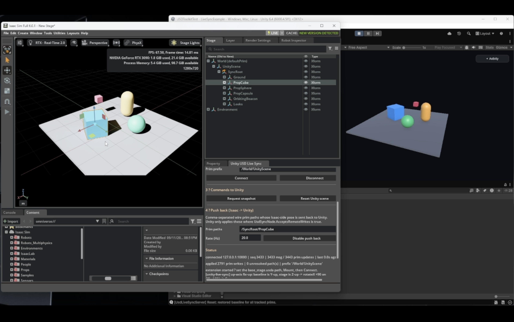
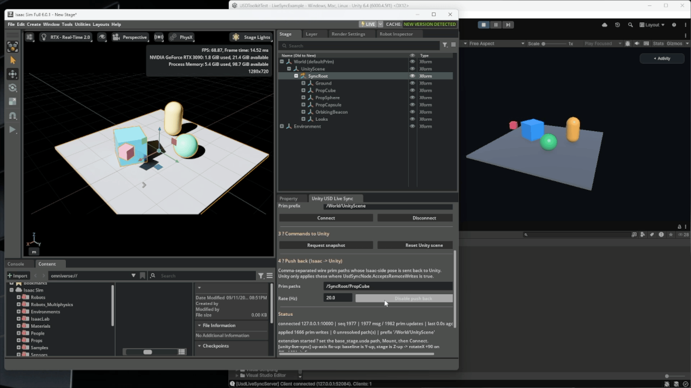
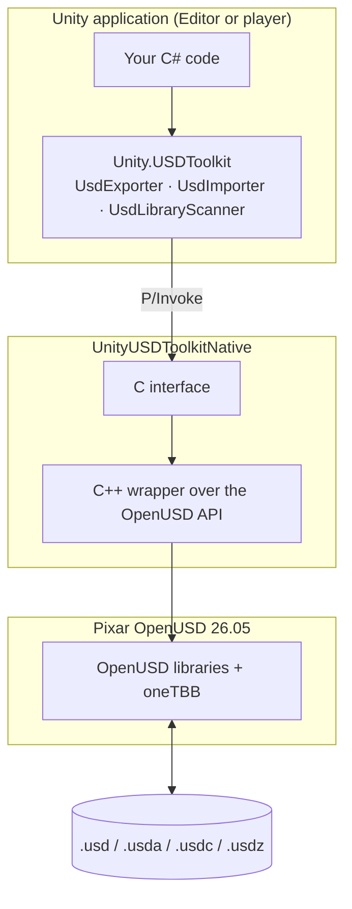

# Unity USD Toolkit


[](LICENSE.md)

<p align="center"></p>

Read and write OpenUSD stages from Unity at runtime, in the Editor and in built players, through Pixar's native OpenUSD 26.05 libraries.

---

The Unity USD Toolkit connects Unity to OpenUSD-based simulation pipelines such as NVIDIA Isaac Sim and Omniverse. It reads and writes the same `.usd`, `.usda`, `.usdc` and `.usdz` files those tools use, with no intermediate format, so you can author a scene in Unity, open it in Isaac Sim, and bring changes back.

The package includes four key capabilities:

- **Runtime export,** which writes any GameObject hierarchy to USD from a running application, with `UsdPreviewSurface` materials and optional PNG textures.
- **Runtime import,** which loads USD stages into GameObjects without freezing the frame, with a preview of mesh and triangle counts before you commit.
- **Safe handling of untrusted files,** which confines texture paths to the stage folder, checks mesh topology and caps image sizes, so you can open USD files from any source.
- **USD Live Sync (prototype),** a sample that streams transform changes between the Unity Editor and Isaac Sim 6.0.1 in both directions.

> **Experimental package.** `com.unity.usd-toolkit` is experimental. The API can change in any `0.x` release, and the package is not supported for production use.

---

## Who this is for

Teams in automotive, manufacturing, robotics and simulation who exchange USD with tools such as NVIDIA Isaac Sim and need Unity to read and write the same stages: static geometry, transform hierarchies, materials and textures.

The toolkit is not a renderer or a simulation runtime. Unity renders imported content with its own materials and render pipeline, and the package does not author or run physics.

## Requirements

| Requirement | Detail |
| --- | --- |
| **Unity** | **6.4 and newer.** |
| **Windows** | x64, Windows 10 version 21H1 or later. Requires the Microsoft Visual C++ Redistributable. |
| **macOS** | Universal (x86_64 + arm64), macOS 12.0 or later. |
| **Git LFS** | Required if you install from Git. The native libraries are stored with LFS. |

## Installation

1. Open **Window > Package Manager**.
2. Select **+ > Add package from git URL**.
3. Enter the following URL, then select **Add**:

   ```text
   https://github.com/Unity-Technologies/com.unity.usd-toolkit.git
   ```

You can also add the package to `Packages/manifest.json`:

```json
{
  "dependencies": {
    "com.unity.usd-toolkit": "https://github.com/Unity-Technologies/com.unity.usd-toolkit.git"
  }
}
```

To install from a local clone or a tarball from the [Releases](https://github.com/Unity-Technologies/com.unity.usd-toolkit/releases) page, use **+ > Add package from disk** or **+ > Add package from tarball**. For a local clone, run `git lfs pull` first.

## Quick start

1. Install the package in a Unity 6.4 or newer project.
2. Create a script named `OpenUsdStage.cs` with the code below.
3. Add the component to an empty GameObject.
4. In the Inspector, set **Usd Path** to the absolute path of a `.usd`, `.usda`, `.usdc` or `.usdz` file.
5. Enter Play mode.

The stage appears as children of the GameObject, and the Console prints a summary.

```csharp
using Unity.USDToolkit;
using UnityEngine;

public class OpenUsdStage : MonoBehaviour
{
    [SerializeField] private string usdPath;

    private async void Start()
    {
        UsdImportPreviewInfo preview = UsdImporter.GetPreviewInfo(usdPath);
        Debug.Log($"{preview.MeshCount} meshes, {preview.TriangleCount} triangles, up axis {preview.UpAxis}");

        UsdImportResult result = await UsdImporter.ImportAsync(usdPath, new UsdImportOptions
        {
            Parent = transform,
            ImportMaterials = true,
            ImportTextures = true
        });

        Debug.Log(result.ToString());
    }
}
```

To write a stage instead:

```csharp
UsdExportResult result = UsdExporter.ExportGameObjectWithResult(
    exportRoot,
    System.IO.Path.Combine(Application.persistentDataPath, "scene.usda"),
    new UsdExportOptions { TransformPolicy = UsdTransformPolicy.PreserveHierarchy });
```

## Samples

The samples are in the package's `Samples` folder. Open them from the Project window under **Packages > Unity USD Toolkit > Samples**.

| Sample | Scene | What it shows |
| --- | --- | --- |
| **Export Example** | `Samples/Export Example/RuntimeExportExample.unity` | A runtime UI that exports the open scene to any USD format, with or without textures, as baked meshes or a preserved hierarchy. |
| **Import Example** | `Samples/Import Example/RuntimeImportBrowser.unity` | A runtime browser that scans a folder for USD files, previews their statistics and imports them. |
| **[USD Live Sync](Samples/Live%20Sync%20Example/README.md)** | `Samples/Live Sync Example/LiveSyncExample.unity` | Two-way transform sync between the Unity Editor and Isaac Sim 6.0.1 or a Python client. |

### USD Live Sync



Unity exports the scene geometry once as `base_stage.usda`, then streams transform changes over loopback TCP. An Omniverse Kit extension, `unity.usd.livesync`, mounts the stage in Isaac Sim, converts it from Y-up to Z-up, and applies the streamed transforms. Isaac Sim can send poses back, including physics-driven poses, for objects you mark as accepting remote writes.

The sample synchronizes transforms only, on a single machine. Isaac Sim is not included with this package; install it separately from NVIDIA under NVIDIA's license terms.

To try it, see the [Live Sync Example guide](Samples/Live%20Sync%20Example/README.md) and the [Isaac Sim client guide](Samples/Live%20Sync%20Example/Tools~/isaacsim/README.md).

## Workflows

### Import an Isaac Sim scene into Unity

1. Save the stage from Isaac Sim as `.usd`, `.usda`, `.usdc` or `.usdz`. Keep referenced textures in the stage's folder.
2. Call `UsdImporter.GetPreviewInfo` to check the mesh count, up axis and units.
3. Call `UsdImporter.ImportAsync` from the main thread.

The importer reports the stage's up axis and `metersPerUnit` but doesn't apply them. Isaac Sim stages are Z-up by default, so they appear rotated in Unity's Y-up world. To correct this, import under a parent GameObject and rotate and scale that parent:

```csharp
var stageRoot = new GameObject("UsdStageRoot").transform;

UsdImportResult result = await UsdImporter.ImportAsync(path, new UsdImportOptions { Parent = stageRoot });

if (result.UpAxis == "Z")
{
    stageRoot.localRotation = Quaternion.Euler(-90f, 0f, 0f); // Stage +Z becomes Unity +Y.
}

stageRoot.localScale = Vector3.one * (float)result.MetersPerUnit; // Stage units to meters.
```

### Export a Unity scene for Isaac Sim

1. Choose the root GameObject to export.
2. Call `UsdExporter.ExportGameObjectWithResult`. Set `TransformPolicy = UsdTransformPolicy.PreserveHierarchy` to keep the transform hierarchy, and `ExportTextures = true` to write PNG textures.
3. Open the result in Isaac Sim, or check it with `usdchecker`.

## Features

| | Export (`UsdExporter`) | Import (`UsdImporter`) |
| --- | --- | --- |
| **Formats** | `.usd`, `.usda`, `.usdc`, `.usdz` (with an optional ARKit-compatible mode) | `.usd`, `.usda`, `.usdc`, `.usdz` |
| **Geometry** | Static meshes, including meshes without **Read/Write Enabled** | Static `UsdGeomMesh`, with optional `MeshCollider` |
| **Transforms** | Baked into mesh points, or kept as an `Xform` hierarchy | Every transformable prim becomes a GameObject |
| **Materials** | `UsdPreviewSurface`: base color, opacity, metallic, roughness, emission; one binding per submesh | `UsdPreviewSurface` values become URP, HDRP or Built-in materials |
| **Textures** | Albedo, normal, metallic-smoothness and emission as PNG, with UV tiling and offset | The same set, including textures inside `.usdz` packages |
| **Performance** | | Asynchronous import, spread across frames; statistics preview before import |

**Not supported yet:** skinned meshes, animation, variant sets, payload streaming, materials other than `UsdPreviewSurface` (including MaterialX), physics schemas, and automatic up-axis and unit conversion on import.

## Architecture

The package has three layers. Only the C# API is public.

1. **C# API** (`Unity.USDToolkit`): `UsdExporter`, `UsdImporter` and `UsdLibraryScanner` convert between Unity objects and USD data.
2. **Native plugin** (`UnityUSDToolkitNative`): a C++ library that wraps the OpenUSD API behind a small C interface, called through P/Invoke.
3. **OpenUSD 26.05**: Pixar's OpenUSD libraries and oneTBB, built for each platform and shipped in `Runtime/Plugins`.



The package does not depend on `com.unity.formats.usd`, `com.unity.importer.usd`, `com.unity.exporter.usd`, `com.unity.usd.core` or USD.NET.

### Comparison with other USD packages

| | Unity USD Toolkit | USD for Unity (`com.unity.formats.usd`) | USD Importer / Exporter (`com.unity.importer.usd`, `com.unity.exporter.usd`) |
| --- | --- | --- | --- |
| **USD version** | OpenUSD 26.05 | USD 20.08 | USD 23.02 |
| **Read / write** | Import and export | Import and export | Importer: import. Exporter: export. |
| **Runs in** | Editor and built players | Editor | Editor |
| **Platforms** | Windows x64, macOS (Intel and Apple silicon) | Windows, macOS Intel | Windows, macOS, Linux |

## Documentation

| Document | Contents |
| --- | --- |
| [User Manual](Documentation~/Unity%20USD%20Toolkit%20User%20Manual%20EN.md) | Export and import options, threading, materials, untrusted file handling, standalone builds, troubleshooting and the API reference. |
| [Live Sync Example](Samples/Live%20Sync%20Example/README.md) | Setup, wire protocol, ownership, coordinate conversion and security. |
| [Isaac Sim client](Samples/Live%20Sync%20Example/Tools~/isaacsim/README.md) | The Kit extension, launchers and troubleshooting. |
| [Changelog](CHANGELOG.md) | Release history. |

## Troubleshooting

| Symptom | Cause | Solution |
| --- | --- | --- |
| `DllNotFoundException` | The native libraries are missing or are still Git LFS pointer files. | Run `git lfs pull`. |
| The surface renders black in Isaac Sim | The albedo texture is also assigned to the metallic slot. | Keep `IgnoreAlbedoInMetallicSlot` enabled (the default), or assign a separate metallic map. |
| Textures are missing after import | A texture path points outside the stage folder. | Move the textures next to the stage. For files you trust, set `AllowExternalAssetPaths = true`. |
| Exporting a mesh fails in batch mode | Meshes without **Read/Write Enabled** need a graphics device. | Enable **Read/Write Enabled** on the meshes. |
| The package works in the Editor but not in a player | The player targets an unsupported platform. | Build for Windows x64 or macOS. |

For more, see [Troubleshooting](Documentation~/Unity%20USD%20Toolkit%20User%20Manual%20EN.md#12-troubleshooting) in the User Manual.

---

## Support

For bugs and feature requests, file a [GitHub issue](https://github.com/Unity-Technologies/com.unity.usd-toolkit/issues). Include your Unity version, platform, package version, and the output of `UsdExporter.GetRuntimeInfo()`.

This repository doesn't accept external contributions.

## License

Unity USD Toolkit Package © 2026 Unity Technologies. Licensed under the Unity Companion License for Unity-dependent projects. See [LICENSE.md](LICENSE.md).

Third-party components redistributed with the package remain licensed under their own terms. See [Third-party notices](ThirdPartyNotices.md).

This package does not include or redistribute any NVIDIA software. NVIDIA Isaac Sim and NVIDIA Omniverse are licensed to you by NVIDIA under NVIDIA's own terms.

### Third Party Product disclaimer

The following concerns a product or service (each a "Third Party Product") that
is not developed, owned, or operated by Unity. This information may not be
up-to-date or complete, and is provided to you for your information and
convenience only. Your access and use of any Third Party Product is governed
solely by the terms and conditions of such Third Party Product. Unity makes no
express or implied representations or warranties regarding such Third Party
Products, and will not be responsible or liable, directly or indirectly, for any
actual or alleged damage or loss arising from your use thereof (including damage
or loss arising from any content, advertising, products or other materials on or
available from the provider of any Third Party Products).

### Trademarks

NVIDIA, NVIDIA Isaac Sim, and NVIDIA Omniverse are trademarks and/or registered
trademarks of NVIDIA Corporation in the U.S. and other countries. Universal
Scene Description (USD), OpenUSD, and Pixar are trademarks and/or registered
trademarks of Pixar in the U.S. and other countries. Intel and oneAPI are
trademarks of Intel Corporation or its subsidiaries. Microsoft, Windows, and
Visual C++ are trademarks of the Microsoft group of companies. macOS is a
trademark of Apple Inc. Unity, the Unity logo, and other Unity trademarks are
trademarks or registered trademarks of Unity Technologies or its affiliates in
the U.S. and elsewhere. All other trademarks are the property of their
respective owners. Use of a third-party name or mark in this package is for
identification only and does not imply any endorsement, sponsorship, or
affiliation.
