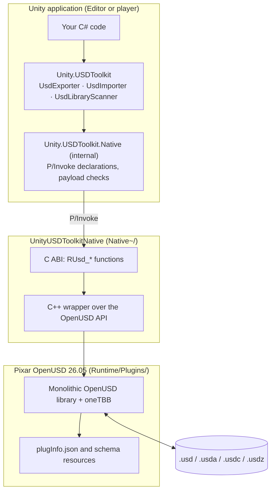

# Unity USD Toolkit

Read and write OpenUSD stages from Unity at runtime, through Pixar's native OpenUSD 26.05 libraries.


[](LICENSE.md)


> **Experimental package.** `com.unity.usd-toolkit` is experimental. The API can change in any `0.x` release without notice, and the package is not supported for production use.


## Built for the OpenUSD ecosystem

The Unity USD Toolkit connects Unity to NVIDIA's simulation stack through OpenUSD. It runs on standard Pixar OpenUSD 26.05, so Unity reads and writes the same `.usd`, `.usda`, `.usdc` and `.usdz` files that Omniverse-based tools use, with no intermediate format. Teams can author a scene in Unity, open it in Isaac Sim, and stream transform changes back to Unity. 

### Integration with Omniverse Kit and Isaac Sim

The USD Live Sync (prototype) sample includes an Omniverse Kit extension, `unity.usd.livesync`, that you load into Isaac Sim 6.0.1 with a launcher script. It makes Isaac Sim a client of a running Unity scene on the same machine:

| Kit API | What the extension does with it |
| --- | --- |
| `omni.usd` | Mounts the Unity-authored `base_stage.usda` into the Isaac Sim stage under a wrapper Xform that converts Y-up to Z-up and applies `metersPerUnit`, then applies streamed transforms to it. |
| `omni.kit.app` | Runs the sync on Kit's update loop, once per update. |
| `omni.ui` | Adds a control panel for mounting the stage, connecting, disconnecting and checking status. |
| `carb` | Logging. |
| `omni.timeline` | The standalone runner starts the timeline with `--play` so Isaac Sim physics runs alongside the stream. The sync itself does not depend on the timeline. |
| `isaacsim.SimulationApp` | Standalone runs, including `--headless`. |

Sync works in both directions. Unity streams transforms to Isaac Sim, and Isaac Sim can send poses back for the objects Unity marks as accepting remote writes, including poses driven by Isaac Sim physics. The sample carries transforms only, over loopback TCP, and has been verified on localhost only.

See [USD Live Sync](#live-sync-editor-changes-to-isaac-sim-prototype) sample that streams transform changes between the Unity Editor and Isaac Sim, with USD as the on-disk record

### Runtime USD import and export

USD export and import run inside your application, not only in the Editor. A built Windows or macOS player can write a stage from its own scene and load a stage into it at run time, with Mono or IL2CPP. Nothing depends on Unity's Editor-only USD packages.

| Capability | What it gives you at run time |
| --- | --- |
| Export from a running scene | `UsdExporter.ExportGameObjectWithResult` writes `.usd`, `.usda`, `.usdc` or `.usdz` from any GameObject, as baked meshes or a preserved `Xform` hierarchy, with `UsdPreviewSurface` materials and optional PNG textures. |
| Non-readable meshes | Meshes without **Read/Write Enabled** are read back from the GPU, so shipped content can be exported without reimporting it. |
| Preview before loading | `UsdImporter.GetPreviewInfo` returns mesh, material, triangle and vertex counts, up axis and units, so an application can warn about a heavy file before importing it. |
| Import without freezing | `UsdImporter.ImportAsync` parses the stage off the main thread and creates GameObjects in frame-budgeted slices (10 ms per frame by default), with a progress callback. |
| Asset libraries | `UsdLibraryScanner.ScanFolder` lists the USD files in a folder, with companion thumbnails, for an in-app browser. |
| Untrusted files | Imported stages are treated as untrusted input: texture paths are confined to the stage folder, mesh topology is checked, and image sizes are capped. |

The Export Example and Import Example samples are runtime UIs built on this API; see [Samples](#samples).

### Licensing

No NVIDIA software is redistributed with this package. The extension calls the Omniverse and Isaac Sim APIs at run time from an Isaac Sim installation you obtain from NVIDIA under NVIDIA's own license terms, and it never writes into that installation. See [License and third-party notices](#license-and-third-party-notices).

## Contents

- [Overview](#overview)
- [Key features](#key-features)
- [How it differs from other USD packages](#how-it-differs-from-other-usd-packages)
- [Architecture](#architecture)
- [Requirements](#requirements)
- [Installation](#installation)
- [Quick start](#quick-start)
- [Samples](#samples)
- [Workflows](#workflows)
- [Documentation](#documentation)
- [Roadmap](#roadmap)
- [Known limitations and troubleshooting](#known-limitations-and-troubleshooting)
- [Contributing and support](#contributing-and-support)
- [License and third-party notices](#license-and-third-party-notices)
- [Developer notes](#developer-notes)

## Overview

Unity USD Toolkit lets a Unity application export GameObjects to USD and import USD stages back into GameObjects while the application is running, in the Editor or in a built player. A small C# API calls a native plugin through P/Invoke; the plugin uses the Pixar OpenUSD C++ API directly. The package does not depend on `com.unity.formats.usd`, `com.unity.importer.usd`, `com.unity.exporter.usd`, `com.unity.usd.core`, or USD.NET.

It is meant for teams in automotive, manufacturing, robotics and simulation that exchange USD with tools such as NVIDIA Isaac Sim and need Unity to read and write the same stages: static geometry, transform hierarchies, `UsdPreviewSurface` materials and textures. A sample shows a prototype transform channel between a running Unity scene and Isaac Sim.

It is not a renderer and not a simulation runtime. Unity renders imported content with its own materials and pipeline, and the package does not author or run physics.

## Key features

### Supported today

**Export** (`UsdExporter`)

| Area | What is written |
| --- | --- |
| Geometry | Static meshes from `MeshFilter` + `MeshRenderer` as `UsdGeomMesh`, with normals, UV0 and authored `extent` |
| Mesh access | Non-readable meshes through GPU readback (no `Read/Write Enabled` needed), CPU path when readable |
| Transforms | Baked into root-local points (default) or kept as `Xform` prims with `UsdTransformPolicy.PreserveHierarchy` |
| Basis | Unity-to-USD conversion with X-axis flip, winding correction, and negative / non-uniform scale handling |
| Materials | `UsdPreviewSurface` base color, opacity, metallic, roughness, emission; one `UsdGeomSubset` binding per submesh |
| Textures | Albedo, normal, metallic-smoothness and emission as linked PNGs, plus UV tiling/offset as `UsdTransform2d` (opt-in) |
| Visibility | Inactive objects and disabled renderers authored as `visibility = "invisible"` when included |
| Formats | `.usd`, `.usda`, `.usdc`, and `.usdz` packages (optional ARKit-compatible mode) |

**Import** (`UsdImporter`, `UsdLibraryScanner`)

| Area | What is read |
| --- | --- |
| Formats | `.usd`, `.usda`, `.usdc`, `.usdz` (packaged textures read through the stage's asset resolver) |
| Geometry | Static `UsdGeomMesh`; optional `MeshCollider` |
| Hierarchy | Every transformable prim becomes a Unity `Transform` with its local position, rotation and scale |
| Materials | `materialBind` subsets become submeshes; `UsdPreviewSurface` values and PBR textures become Unity materials |
| Preview | Default prim, meters-per-unit, up axis and mesh / material / triangle / vertex counts before importing |
| Async | `ImportAsync` parses off the main thread and creates Unity objects in frame-budgeted slices |
| Untrusted input | Texture paths confined to the stage folder, mesh topology checked, image sizes capped |
| Libraries | Folder scanning with companion thumbnails through `UsdLibraryScanner.ScanFolder` |

### Not yet supported

- Skinned meshes and skeletal animation
- Animation of any kind (time samples)
- Variant sets
- Payload streaming
- Automatic up-axis and `metersPerUnit` conversion on import (values are reported only; see [Import an Isaac Sim USD scene into Unity](#import-an-isaac-sim-usd-scene-into-unity))
- Materials other than `UsdPreviewSurface` (MaterialX is not built into the shipped OpenUSD libraries)
- Mobile, WebGL and console platforms
- Physics schemas: the libraries include the `usdPhysics` schema, but the C# API neither reads nor writes physics data

## How it differs from other USD packages

Facts below come from each package's official documentation, checked on 2026-10-01. A cell marked "Unverified" was not stated in those docs.

| | Unity USD Toolkit (this package) | USD for Unity (`com.unity.formats.usd`) | Unity USD Importer / Exporter (`com.unity.importer.usd`, `com.unity.exporter.usd`, `com.unity.usd.core`) | NVIDIA Omniverse Unity Connector |
| --- | --- | --- | --- | --- |
| Underlying USD version | OpenUSD 26.05 | USD 20.08 | USD 23.02 (`com.unity.usd.core`) | USD 22.11 |
| Binding approach | Pixar's native C++ libraries behind a small C ABI, called with P/Invoke | USD.NET C# bindings | C# bindings to the C++ USD API in `com.unity.usd.core` | Unverified |
| Read / write | Import and export | Import and export | Importer: import. Exporter: export. | Export and live sync |
| Runtime or Editor | Runtime (Editor and built players) | Editor import/export workflows | Editor | Editor |
| Platforms | Windows x64, macOS (x86_64 + arm64), Linux x64 | Windows, macOS Intel (no Apple Silicon) | Windows, macOS, Linux (`com.unity.usd.core`) | Windows 10 / 11 |
| Unity versions | 2023.1 or later | Unverified | 2023.1 or later | 2021 LTS, 2022 LTS; not compatible with Unity 6 |
| Status | Experimental (`0.7.2-exp.1`) | Experimental (`3.0.0-exp.5`), legacy | Importer pre-release, Exporter experimental | NVIDIA states connectors are deprecated |

Sources: [USD for Unity 3.0 manual](https://docs.unity3d.com/Packages/com.unity.formats.usd@3.0/manual/index.html), [Understanding Unity's USD packages](https://docs.unity3d.com/Packages/com.unity.exporter.usd@1.0/manual/UnderstandingUsdPackages.html), [USD Core manual](https://docs.unity3d.com/Packages/com.unity.usd.core@1.0/manual/index.html), [USD Importer manual](https://docs.unity3d.com/Packages/com.unity.importer.usd@1.0/manual/index.html), [Omniverse Unity Connector requirements](https://docs.omniverse.nvidia.com/connect/latest/unity/requirements.html), [NVIDIA developer forum on connector deprecation](https://forums.developer.nvidia.com/t/unity-how-to-start-everything-with-unity/353819).

## Architecture

The package has three layers. Only the top one is public API.

1. **OpenUSD native libraries.** Pixar OpenUSD 26.05 built as a single monolithic shared library per platform (`usd_rt.dll`, `libusd_ms.dylib`, `libusd_ms.so`) with oneTBB, plus the `plugInfo.json` and schema resources OpenUSD loads at startup. Shipped under `Runtime/Plugins/`.
2. **C ABI shim** (`Native~/`). `UnityUSDToolkitNative` is a C++ library (`Native~/src/UsdExporter.cpp`, `Native~/include/unity_usd_toolkit_native.h`) that uses the OpenUSD C++ API and exposes flat `RUsd_*` C functions for opening stages, reading meshes and materials, and writing meshes, materials and transforms. It reports a native API version (currently 5) that the C# layer requires to match exactly.
3. **C# API** (`Runtime/`, namespace `Unity.USDToolkit`). `UsdExporter`, `UsdImporter` and `UsdLibraryScanner` convert between Unity objects and the shim's buffers, configure OpenUSD's plugin path before the first call, and check the native payload before loading it. `Unity.USDToolkit.Native` is internal.

An Editor build postprocessor (`Editor/RuntimeUsdBuildPostprocessor.cs`) copies the OpenUSD resource tree into built players, because Unity's plugin importer does not move data files such as `plugInfo.json`.



<!-- PLACEHOLDER: image — Polished version of the Mermaid architecture diagram above: three stacked layers (C# API, C ABI shim, OpenUSD native libraries) with the P/Invoke boundary marked and USD files at the bottom. Light background, 1600x900. -->


## Requirements

**Unity:** 2023.1 or later (`package.json`). Verified in Unity 6000.4 (6000.4.10f1 on macOS and Windows, 6000.4.11f1 on Linux).

**Platforms:**

| Platform | Architecture | Editor | Standalone player | Minimum OS | Native payload |
| --- | --- | --- | --- | --- | --- |
| Windows | x64 | Yes | Yes | Windows 10 version 21H1 | `Runtime/Plugins/x86_64/Windows` |
| macOS | Universal (x86_64 + arm64) | Yes | Yes | macOS 12.0 | `Runtime/Plugins/macOS` |
| Linux | x64 | Yes | See note | Ubuntu 24.04 (glibc 2.38, `GLIBCXX_3.4.32`) | `Runtime/Plugins/x86_64/Linux` |
| Mobile, WebGL, consoles | — | No | No | — | — |

Linux note: the native payload and the build postprocessor handle Linux players, but `Runtime/Unity.USDToolkit.asmdef` lists only `Editor`, `macOSStandalone` and `WindowsStandalone64` as included platforms, so the C# API is not compiled into a Linux player as shipped.

The Linux payload is built on Ubuntu 24.04 and does not load on Ubuntu 22.04, even though Unity supports 22.04. These minimums apply to players you build as well as to the Editor.

**Scripting backends:** Mono and IL2CPP.

**Render pipelines:** export reads the common Built-in, URP and HDRP texture property names (`_BaseMap` / `_MainTex` / `_BaseColorMap`, `_BumpMap` / `_NormalMap`, `_MetallicGlossMap` / `_MetallicMap`, `_EmissionMap`). Import creates materials with the first shader it finds of `Universal Render Pipeline/Lit`, `HDRP/Lit`, `Standard`.

**Other:**

- Git LFS, if you get the package from Git. The native binaries are stored with LFS and the plugin does not load while they are still pointer files.
- On Windows, the Microsoft Visual C++ Redistributable on the target machine. The package does not bundle it.

## Installation

The package is at the root of its repository, so Git URLs need no `?path=` suffix.

### From a Git URL in the Package Manager

1. Open **Window > Package Manager**.
2. Select **+ > Add package from git URL...**.
3. Enter the repository URL:

   ```text
   https://github.com/Unity-Technologies/com.unity.usd-toolkit.git
   ```

4. Select **Add**.

<!-- PLACEHOLDER: image — Package Manager window with the "+" menu open and "Add package from git URL..." highlighted, URL field filled with the com.unity.usd-toolkit Git URL. Crop to the Package Manager window, 1280x800. -->


### By editing `Packages/manifest.json`

Add the package to `dependencies`:

```json
{
  "dependencies": {
    "com.unity.usd-toolkit": "https://github.com/Unity-Technologies/com.unity.usd-toolkit.git"
  }
}
```

### From a local folder or tarball

From a clone:

```sh
git clone https://github.com/Unity-Technologies/com.unity.usd-toolkit.git
cd com.unity.usd-toolkit
git lfs pull
```

Then do one of the following:

- Copy the folder to `<YourProject>/Packages/com.unity.usd-toolkit` so that `Packages/com.unity.usd-toolkit/package.json` exists.
- In the Package Manager, select **+ > Add package from disk...** and choose the package's `package.json`.
- Reference it from `Packages/manifest.json`:

  ```json
  "com.unity.usd-toolkit": "file:Packages/com.unity.usd-toolkit"
  ```

From a tarball:

1. Download the package `.tgz` from the repository's [Releases](https://github.com/Unity-Technologies/com.unity.usd-toolkit/releases) page.
2. In the Package Manager, select **+ > Add package from tarball...** and choose the downloaded file.

Open the Editor and check the Console for compile errors.

### Samples

The samples are under `Samples/` and compile with the package, so there is no import step. Open their scenes from the package folder in the Project window (**Packages > Unity USD Toolkit > Samples**).

The package does not declare a `samples` array in `package.json`, so the samples do not appear in the Package Manager **Samples** tab. 

<!-- PLACEHOLDER: image — Package Manager details pane for Unity USD Toolkit with the Samples tab open, listing Export Example, Import Example and Live Sync Example with Import buttons. Capture only once the samples are registered in package.json; see the TODO above. 1280x800. -->
<!--  -->

## Quick start

Open a USD stage in a new project:

1. Create a project in Unity 2023.1 or later on Windows, macOS or Linux.
2. Add the package (see [Installation](#installation)).
3. Check the Console for compile errors.
4. Create a script named `OpenUsdStage.cs` with the code below.
5. Add the component to an empty GameObject in a scene.
6. Set **Usd Path** in the Inspector to the absolute path of a `.usd`, `.usda`, `.usdc` or `.usdz` file.
7. Enter Play mode. The stage is created as children of the GameObject and the Console prints a summary.

```csharp
using Unity.USDToolkit;
using UnityEngine;

public class OpenUsdStage : MonoBehaviour
{
    [SerializeField] private string usdPath;

    private async void Start()
    {
        UsdImportPreviewInfo preview = UsdImporter.GetPreviewInfo(usdPath);
        Debug.Log($"{preview.MeshCount} meshes, {preview.TriangleCount} triangles, up axis {preview.UpAxis}");

        UsdImportResult result = await UsdImporter.ImportAsync(usdPath, new UsdImportOptions
        {
            Parent = transform,
            ImportMaterials = true,
            ImportTextures = true
        });

        Debug.Log(result.ToString());
    }
}
```

To write a stage instead:

```csharp
UsdExportResult result = UsdExporter.ExportGameObjectWithResult(
    exportRoot,
    System.IO.Path.Combine(Application.persistentDataPath, "scene.usda"),
    new UsdExportOptions { TransformPolicy = UsdTransformPolicy.PreserveHierarchy });
```

## Samples

| Sample | Scene | Shows |
| --- | --- | --- |
| [Export Example](#export-example) | `Samples/Export Example/RuntimeExportExample.unity` | Runtime export with a UI for options and format |
| [Import Example](#import-example) | `Samples/Import Example/RuntimeImportBrowser.unity` | Folder scan, preview and import of USD files |
| [USD Live Sync (prototype)](#usd-live-sync-prototype) | `Samples/Live Sync Example/LiveSyncExample.unity` | Transform sync over TCP with a Python client or Isaac Sim 6.0.1 |

### Export Example

Exports the open scene to USD from a runtime UI.

<!-- PLACEHOLDER: gif — Export Example in Play mode: choose output folder, switch Baked Mesh / Hierarchy, pick .usdc from the format list, press "Export USD (with Textures)", then the result summary appears. 10–15 s, 1280x720. -->


**Demonstrates:** `UsdExporter.ExportGameObjectWithResult`; `BakedMesh` versus `PreserveHierarchy`; mesh-only versus texture export; `.usd`, `.usda`, `.usdc` and `.usdz` output; the `IgnoreAlbedoInMetallicSlot` toggle; runtime diagnostics from `UsdExporter.GetRuntimeInfo`.

**Prerequisites:** none beyond the package.

**Run it:**

1. Open `Samples/Export Example/RuntimeExportExample.unity` and enter Play mode, or build a player containing the scene.
2. Choose an output folder and file name. The default is `Application.persistentDataPath/UsdExports/runtime-usd-export.usd`.
3. Select **Export USD (Mesh Only)** or **Export USD (with Textures)**. Both are also on the `UsdExportExample` component's context menu.
4. Use **Recreate Demo Geometry** to rebuild the demo export target.

### Import Example

Scans a folder for USD files, shows stage statistics, and imports the selected files.

<!-- PLACEHOLDER: gif — Import Browser in Play mode: enter a folder, press Scan, the file list fills with thumbnails, select a file, press Preview File (counts shown), press Import Selected, the geometry appears in the Game view. 10–15 s, 1280x720. -->


**Demonstrates:** `UsdLibraryScanner.ScanFolder` with companion thumbnails; `UsdImporter.GetPreviewInfo`; `UsdImporter.Import`; thumbnail loading within size limits through `UsdImporter.LoadImageFile`.

**Prerequisites:** a folder of USD files, or none if you use **Export Cube**.

**Run it:**

1. Open `Samples/Import Example/RuntimeImportBrowser.unity` and enter Play mode.
2. Enter a folder or file path, or use the browse buttons.
3. Select **Scan**, then **Preview File**, **Import File** or **Import Selected**.
4. Select **Export Cube** to write a small USD file into the current folder for a self-contained test, and **Clear Imported** to remove imported objects.

### USD Live Sync (prototype)

A prototype TCP transport that streams transform changes between the Unity Editor and Isaac Sim 6.0.1, with USD as the on-disk record. Verified on localhost only.

<!-- PLACEHOLDER: gif — Unity Editor in Play mode (left) and Isaac Sim 6.0.1 (right) on the same machine. Move PropCube in Unity; the same prim moves in Isaac Sim. Then push a pose back from Isaac and PropCube moves in Unity. 15–20 s, 1920x1080. -->


**Demonstrates:**

- Exporting the scene geometry once as `base_stage.usda` with `PreserveHierarchy`, then streaming only transform changes as newline-delimited JSON over loopback TCP (`127.0.0.1:10000`).
- Per-object ownership: inbound edits apply only where `UsdSyncNode.AcceptsRemoteWrites` is true.
- Writing the live state to a `live_overrides.usda` layer that sublayers the baseline.
- Mounting `base_stage.usda` in Isaac Sim under a wrapper Xform that converts Y-up to Z-up.

It is a sample, not part of the supported API, and is built only on the public `UsdExporter` surface.

**Prerequisites:**

- Python 3 for `Tools~/usd_live_sync.py`. `--checkpoint` also needs `pip install usd-core`.
- For the Isaac Sim client: NVIDIA Isaac Sim 6.0.1, installed separately from NVIDIA under NVIDIA's license terms. The launchers are Windows batch files. Isaac Sim is not included with this package.

**Run it with the Python client:**

1. Open `Samples/Live Sync Example/LiveSyncExample.unity` and enter Play mode.
2. From `Samples/Live Sync Example/Tools~`:

   ```sh
   python usd_live_sync.py --watch                                           # stream transforms
   python usd_live_sync.py --set /SyncRoot/PropCube --translate=0.5,1.2,-0.4 # push an edit
   python usd_live_sync.py --checkpoint                                      # write live_overrides.usda
   python usd_live_sync.py --reset                                           # restore the baseline
   ```

**Run it with Isaac Sim (Windows):**

1. Keep Unity in Play mode.
2. Run `Samples\Live Sync Example\Tools~\isaacsim\run_isaac_sim_with_livesync.bat`. Set `ISAACSIM_PATH` if Isaac Sim is not in `C:\isaacsim` or `%USERPROFILE%\isaacsim`.
3. In the **Unity USD Live Sync** panel, select **Mount Unity stage**, then **Connect**.

See `Samples/Live Sync Example/README.md` and `Samples/Live Sync Example/Tools~/isaacsim/README.md` for the wire protocol, server settings, coordinate conversion and troubleshooting.

## Workflows

### Import an Isaac Sim USD scene into Unity

Supported for static meshes, transforms and `UsdPreviewSurface` materials. Physics, variants, animation and other material types are not imported.

<!-- PLACEHOLDER: image — Workflow diagram: Isaac Sim saves a .usd/.usdc → UsdImporter.GetPreviewInfo (counts, up axis) → UsdImporter.ImportAsync → Unity GameObject hierarchy with meshes and materials. Mark what is dropped (physics, variants, non-UsdPreviewSurface materials). 1600x600. -->


1. Save or export the stage from Isaac Sim as `.usd`, `.usda`, `.usdc` or `.usdz`. Keep referenced textures in the stage's folder; paths outside it are skipped unless you set `UsdImportOptions.AllowExternalAssetPaths`.
2. Call `UsdImporter.GetPreviewInfo` to check counts, up axis and meters-per-unit.
3. Call `UsdImporter.ImportAsync` from the main thread.

**Up axis and units are reported, not applied.** The importer converts USD's right-handed basis to Unity's with an X-axis flip, but it does not rotate or scale for the stage's `upAxis` or `metersPerUnit`. Both values are returned in `UsdImportPreviewInfo` and `UsdImportResult` so you can correct for them yourself. Isaac Sim stages are Z-up by default, so they arrive lying on their side in Unity's Y-up world.

None of the samples correct for this on import: the Import Example only displays the two values. The one place the repo handles it is the opposite direction, in the USD Live Sync (prototype) Isaac Sim extension. It loads Unity's Y-up `base_stage.usda` under a dedicated wrapper Xform that carries a `rotateX` of +90° and a `metersPerUnit` scale, so the fix-up is applied once and child transforms stay untouched.

The same pattern works in Unity: import under a dedicated parent and put the correction on that parent. A sketch, not covered by a test in the repo:

```csharp
var wrapper = new GameObject("UsdStageRoot").transform;

UsdImportResult result = await UsdImporter.ImportAsync(path, new UsdImportOptions { Parent = wrapper });

if (result.UpAxis == "Z")
{
    wrapper.localRotation = Quaternion.Euler(-90f, 0f, 0f); // stage +Z becomes Unity +Y
}

wrapper.localScale = Vector3.one * (float)result.MetersPerUnit; // stage units to meters
```

### Export a Unity scene to USD

<!-- PLACEHOLDER: image — Workflow diagram: Unity GameObject hierarchy → UsdExporter.ExportGameObjectWithResult (BakedMesh or PreserveHierarchy, optional textures) → .usd/.usda/.usdc/.usdz plus <name>_textures/ → opened in usdview or Isaac Sim. 1600x600. -->


1. Choose an export root GameObject.
2. Call `UsdExporter.ExportGameObjectWithResult` with `TransformPolicy = PreserveHierarchy` if the downstream tool needs the transform hierarchy, and `ExportTextures = true` to write PNG textures.
3. Check the result with `usdchecker` or `usdcat`, then open it in the target tool.

### Live-sync Editor changes to Isaac Sim (prototype)

<!-- PLACEHOLDER: image — Workflow diagram: Unity (UsdLiveSyncServer, host) writes base_stage.usda once and streams transform deltas over TCP 127.0.0.1:10000 to clients: usd_live_sync.py and the Isaac Sim Kit extension (mounts base_stage.usda under /World/UnityScene). Arrow back for set_transform where AcceptsRemoteWrites is true. Label "localhost only". 1600x700. -->


Transforms only, one machine only. See [USD Live Sync (prototype)](#usd-live-sync-prototype).

## Documentation

| Document | Contents |
| --- | --- |
| [User Manual (English)](Documentation~/Unity%20USD%20Toolkit%20User%20Manual%20EN.md) | Scope, installation, export and import options, untrusted input handling, standalone builds, troubleshooting, API summary |
| [User Manual (Korean)](Documentation~/Unity%20USD%20Toolkit%20User%20Manual%20KR.md) | Korean edition of the user manual |
| [Pixar OpenUSD Windows build notes](Documentation~/pixar-openusd-windows-build.md) | Why the package uses a C ABI shim; Windows OpenUSD build shape |
| [Development summary, 2026-05-11](Documentation~/development-summary-2026-05-11.md) | Package history at the 0.1.0 milestone |
| [Test results, 2026-05-11](Documentation~/test-results-2026-05-11.md) | Build and smoke test log at the 0.1.0 milestone |
| [Live Sync sample README](Samples/Live%20Sync%20Example/README.md) | Wire protocol, server configuration, ownership, coordinate conversion |
| [Isaac Sim client README](Samples/Live%20Sync%20Example/Tools~/isaacsim/README.md) | Kit extension, launchers, mock server, troubleshooting |
| [Building the native plugin](Native~/README.md) | Native build entry point |
| [Changelog](CHANGELOG.md) | Release history |

Section links for the English manual:

- [1. Overview](Documentation~/Unity%20USD%20Toolkit%20User%20Manual%20EN.md#1-overview)
- [2. Scope and limitations](Documentation~/Unity%20USD%20Toolkit%20User%20Manual%20EN.md#2-scope-and-limitations)
- [5. Exporting at runtime](Documentation~/Unity%20USD%20Toolkit%20User%20Manual%20EN.md#5-exporting-at-runtime)
- [7. Importing at runtime](Documentation~/Unity%20USD%20Toolkit%20User%20Manual%20EN.md#7-importing-at-runtime)
- [9. How untrusted USD files are handled](Documentation~/Unity%20USD%20Toolkit%20User%20Manual%20EN.md#9-how-untrusted-usd-files-are-handled)
- [13. Troubleshooting](Documentation~/Unity%20USD%20Toolkit%20User%20Manual%20EN.md#13-troubleshooting)
- [Appendix A. Public API summary](Documentation~/Unity%20USD%20Toolkit%20User%20Manual%20EN.md#appendix-a-public-api-summary)

## Roadmap

Not committed. Items may change or be dropped.

- Skinned meshes and animation
- Variant sets on import
- Payload streaming
- Materials beyond `UsdPreviewSurface` 
- USD validation tooling 

Transform hierarchy and texture import and export are already supported; see [Key features](#key-features).

## Known limitations and troubleshooting

**Limitations**

- Static geometry only; see [Not yet supported](#not-yet-supported).
- Linux Standalone players: see the note under [Requirements](#requirements).
- Linux needs Ubuntu 24.04 or newer; the payload does not load on 22.04.
- GPU readback for non-readable meshes needs a graphics device. For headless or `-nographics` runs, enable **Read/Write Enabled** on meshes.
- The USD Live Sync sample is loopback-only, carries transforms only, and its Isaac Sim launchers are Windows batch files.
- Rebuilding the native plugin changes its digests; see [Developer notes](#native-payload-integrity).

**Troubleshooting**

| Symptom | Likely cause | What to do |
| --- | --- | --- |
| `DllNotFoundException` | Native files missing or still Git LFS pointers | Run `git lfs pull` and check the platform folder under `Runtime/Plugins/` |
| Native API version mismatch | Plugin built from older source | Rebuild that platform's plugin from `Native~/` |
| Load refused on a digest mismatch | Payload differs from `Runtime/Native/NativeRuntimeHashes.g.cs` | If you rebuilt it, run `python3 Native~/generate_native_hashes.py`; otherwise re-acquire the package |
| OpenUSD plugin path error | `plugin/usd` or `lib/usd` missing | Confirm the `plugInfo.json` files are present |
| `PluginSearchPath` rejected | Path outside the package's native folders | Set `UsdExporter.AllowExternalPluginSearchPath = true` from code if intended |
| Mesh is not readable | Neither GPU nor CPU path could read it | Enable **Read/Write Enabled**, or export in Play mode with a graphics device |
| Textures missing after import | Texture path resolved outside the stage folder | Read the Console warning; for a trusted file set `AllowExternalAssetPaths` |
| Some meshes missing after import | Inconsistent topology was rejected | The warning names the prim; fix the source file |
| Exported surface renders black in Isaac Sim | Albedo texture in the metallic slot | Keep `IgnoreAlbedoInMetallicSlot = true` (default); see [Developer notes](#metallic-map-misassignment-guard) |
| Works in the Editor, fails in a player | Payload missing from the build | Check the player's `Plugins` folder (paths in [Developer notes](#standalone-player-layout)) |
| Live Sync: `--set` reports `unknown` in Git Bash | MSYS rewrote the prim path | Prefix with `MSYS_NO_PATHCONV=1`, or use PowerShell or `cmd` |

Print the loaded runtime's state:

```csharp
Debug.Log(UsdExporter.GetRuntimeInfo().ToString()); // native API version, OpenUSD version, search paths
```

## Contributing and support

This repository is public for visibility and issue reporting. External contributions are not accepted at this time, and pull requests from outside Unity will be closed.

Report bugs and requests in [Issues](https://github.com/Unity-Technologies/com.unity.usd-toolkit/issues). Include the Unity version, platform, package version and the output of `UsdExporter.GetRuntimeInfo()`.

## License and third-party notices

Unity-authored code in this package is licensed as stated in [LICENSE.md](LICENSE.md): the Unity Companion License for Unity-dependent projects.

The package redistributes Pixar OpenUSD 26.05, licensed under the Tomorrow Open Source Technology License 1.0, and oneTBB and other components under their own licenses. See [ThirdPartyNotices.md](ThirdPartyNotices.md), the full license texts in `ThirdPartyNotices~/licenses/`, and the CycloneDX bill of materials in `ThirdPartyNotices~/sbom.cdx.json`.

`ThirdPartyNotices.md` also records products the package integrates with but does not redistribute, notably NVIDIA Isaac Sim, used by the USD Live Sync sample. No NVIDIA software is included; the sample's Kit extension calls NVIDIA-provided APIs from an Isaac Sim installation you obtain from NVIDIA under NVIDIA's own license terms.

### Third Party Product disclaimer

The following concerns a product or service (each a "Third Party Product") that
is not developed, owned, or operated by Unity. This information may not be
up-to-date or complete, and is provided to you for your information and
convenience only. Your access and use of any Third Party Product is governed
solely by the terms and conditions of such Third Party Product. Unity makes no
express or implied representations or warranties regarding such Third Party
Products, and will not be responsible or liable, directly or indirectly, for any
actual or alleged damage or loss arising from your use thereof (including damage
or loss arising from any content, advertising, products or other materials on or
available from the provider of any Third Party Products).

### Trademarks

NVIDIA, NVIDIA Isaac Sim, and NVIDIA Omniverse are trademarks and/or registered
trademarks of NVIDIA Corporation in the U.S. and other countries. Universal
Scene Description (USD), OpenUSD, and Pixar are trademarks and/or registered
trademarks of Pixar in the U.S. and other countries. Intel and oneAPI are
trademarks of Intel Corporation or its subsidiaries. Microsoft, Windows, and
Visual C++ are trademarks of the Microsoft group of companies. macOS is a
trademark of Apple Inc. Unity, the Unity logo, and other Unity trademarks are
trademarks or registered trademarks of Unity Technologies or its affiliates in
the U.S. and elsewhere. All other trademarks are the property of their
respective owners. Use of a third-party name or mark in this package is for
identification only and does not imply any endorsement, sponsorship, or
affiliation.

---

## Developer notes

Reference material for users who need detail beyond the quick start, and for anyone rebuilding the native plugin.

### Public API and versioning

Supported managed API, all in `Unity.USDToolkit`:

| Type | Purpose |
| --- | --- |
| `UsdExporter` | `ExportGameObject`, `ExportGameObjectWithResult`, `GetRuntimeInfo`, static `AllowExternalPluginSearchPath` |
| `UsdImporter` | `GetPreviewInfo`, `Import`, `ImportAsync`, `LoadImageFile` |
| `UsdLibraryScanner` | `ScanFolder`, with `UsdLibraryScanOptions` and `UsdLibraryItem` |
| `UsdExportOptions`, `UsdImportOptions` | Behaviour options |
| `UsdExportResult`, `UsdExportedMeshInfo` | Export summary |
| `UsdImportResult`, `UsdImportedMeshInfo`, `UsdImportPreviewInfo` | Import summary and pre-import statistics |
| `UsdExportException`, `UsdImportException` | Failures with diagnostics |
| `UsdRuntimeInfo` | Native API version, OpenUSD version, search paths |
| `UsdTransformPolicy` | `BakedMesh` or `PreserveHierarchy` |

Everything under `Unity.USDToolkit.Native` and the native `RUsd_*` C ABI is an internal implementation detail. Reaching it by reflection skips the runtime initialization and the validation that turns a misconfigured payload into a catchable exception.

Version `0.x` may introduce breaking API changes while the toolkit moves toward a `1.0.0` contract. From `1.0.0`, public managed API changes are intended to follow SemVer: breaking changes in a major version, compatible features in a minor version, fixes in a patch version.

There are no obsolete compatibility aliases. The pre-release names `IP.RuntimeUsdExporter` / `RuntimeUsdExporter` were not kept as aliases.

### Threading and initialization

**The native runtime must be configured before OpenUSD opens a stage.** Every public entry point does this for you: `UsdImporter.GetPreviewInfo`, `UsdImporter.Import`, `UsdImporter.ImportAsync`, `UsdExporter.ExportGameObject*` and `UsdExporter.GetRuntimeInfo` all configure the runtime first, which sets `PXR_PLUGINPATH_NAME` so OpenUSD can find its `plugInfo.json` files.

Without that configuration OpenUSD fails inside `PlugFindPluginResource` with a `TfFatalError`. That is a native abort, not a managed exception: it bypasses `try`/`catch`, returns no error code, and terminates the process. Since 0.6.5 the internal `UsdNative` entry points guard against this themselves.

| Call | Thread |
| --- | --- |
| `UsdImporter.ImportAsync` | Call from the main thread. The USD parse, buffer copies and texture file reads run on a worker; Unity object creation runs on the main thread, sliced across frames (`MaxMillisecondsPerFrame`, default 10 ms), with an optional `ProgressCallback` (`0..1`, phase). |
| `UsdImporter.Import`, `UsdImporter.GetPreviewInfo` | Run on the calling thread. `GetPreviewInfo` touches no Unity objects, so a worker thread is fine. |
| `UsdImporter.LoadImageFile` | Main thread; it creates a `Texture2D`. |
| `UsdExporter.ExportGameObject*` | Main thread; it reads Unity meshes, materials and textures. |

Anything that creates or reads Unity objects must run on the main thread; that is a Unity constraint, not a USD one. OpenUSD stage reads are not main-thread-bound.

### Export options

| Option | Default | Notes |
| --- | --- | --- |
| `RootPrimName` | `null` | Uses the export root GameObject name when empty. |
| `MetersPerUnit` | `1.0f` | Must be greater than zero. |
| `IncludeInactive` | `false` | Excludes inactive child GameObjects by default. |
| `RequireReadableMeshes` | `true` | Throws when a mesh cannot be read. With `false`, non-readable meshes go through GPU readback. |
| `ExportNormals` | `true` | Authors normals when the Unity mesh has them. |
| `ExportUv0` | `true` | Authors UV0 when the Unity mesh has it. |
| `ExportBounds` | `true` | Authors mesh extent. |
| `ExportDisabledRenderers` | `true` | Includes disabled renderers as invisible. |
| `PreserveInactiveAndDisabledVisibility` | `true` | Authors `visibility = "invisible"` for included inactive/disabled objects. |
| `ExportTextures` | `false` | Writes PNG textures to `<usd-name>_textures/` and references them relatively. |
| `UsdzArkitCompatible` | `false` | `.usdz` output only: packages under ARKit (AR Quick Look) constraints, which may drop features such as variant sets. |
| `IgnoreAlbedoInMetallicSlot` | `true` | Drops the metallic map (uses scalar `_Metallic`) when it is the same texture as the albedo map. Logs a warning when triggered. |
| `TransformPolicy` | `UsdTransformPolicy.BakedMesh` | Bakes transforms into mesh points unless set to `PreserveHierarchy`. |
| `ValidateNativeRuntime` | `true` | Checks that the native plugin and OpenUSD payload are present. |
| `VerifyNativeRuntimeIntegrity` | `true` | Compares each shipped native file against the SHA-256 digest in `Runtime/Native/NativeRuntimeHashes.g.cs` before the first P/Invoke and refuses a mismatch. Runs once per process. Setting it to `false` is honoured only in the Editor and development builds. |
| `ValidateOpenUsdPluginPath` | `true` | Checks OpenUSD plugin/resource discovery paths. |
| `CaptureNativeDiagnostics` | `false` | Captures Pixar OpenUSD diagnostics. |
| `LogExportSummary` | `false` | Logs `UsdExportResult.ToString()` after a successful export. |
| `PluginSearchPath` | `null` | Optional override for OpenUSD plugin discovery. Must resolve inside the package's own native runtime folders, because OpenUSD loads and executes any library a `plugInfo.json` under this path names. Anything outside is refused unless the static `UsdExporter.AllowExternalPluginSearchPath` is set from code. |
| `NativeDiagnosticsLogPath` | `null` | Optional output path for captured diagnostics. |

Full export example:

```csharp
using Unity.USDToolkit;
using UnityEngine;

public class ExportButton : MonoBehaviour
{
    [SerializeField] private GameObject exportRoot;

    public void Export()
    {
        string path = System.IO.Path.Combine(
            Application.persistentDataPath,
            "robot.usdc");

        UsdExportResult result = UsdExporter.ExportGameObjectWithResult(exportRoot, path, new UsdExportOptions
        {
            RootPrimName = "Robot",
            MetersPerUnit = 1.0f,
            IncludeInactive = false,
            ExportBounds = true,
            TransformPolicy = UsdTransformPolicy.BakedMesh,
            PreserveInactiveAndDisabledVisibility = true,
            CaptureNativeDiagnostics = true,
            NativeDiagnosticsLogPath = System.IO.Path.Combine(
                Application.persistentDataPath,
                "robot-usd-diagnostics.log")
        });

        Debug.Log(result.ToString());
    }
}
```

Source meshes do not need **Read/Write Enabled** when `RequireReadableMeshes` is `false`: non-readable meshes are exported through GPU readback, which also works in Play mode. Leave `RequireReadableMeshes = true` if you want the exporter to throw on non-readable meshes instead.

A `.usdz` output path writes a usdz package. Because usdz is a read-only zip, the stage is written as `.usdc` in a temporary staging folder and packaged from there, textures included; nothing is left next to the `.usdz`. `.usdz` export needs native API 5 and throws a clear message otherwise.

### Import options

| Option | Default | Notes |
| --- | --- | --- |
| `Parent` | `null` | Parent `Transform` for the created root. |
| `RootObjectName` | `null` | Falls back to the file name. |
| `ImportMaterials` | `true` | Turns `UsdPreviewSurface` values into Unity materials. |
| `ImportTextures` | `true` | Loads referenced PBR textures. |
| `IncludeInvisible` | `true` | Also creates prims marked `visibility = "invisible"`. |
| `GenerateColliders` | `false` | Adds a `MeshCollider`. |
| `RecalculateNormalsIfMissing` | `true` | Computes normals when the file has none. |
| `AllowExternalAssetPaths` | `false` | Allows texture reads outside the stage folder. |
| `MaxMillisecondsPerFrame` | `10f` | Main-thread budget per frame for `ImportAsync`. |
| `ProgressCallback` | `null` | `(0..1, phase)`, invoked on the main thread. |
| `CaptureNativeDiagnostics` | `false` | |
| `NativeDiagnosticsLogPath` | `null` | |

Import details:

- Texture mapping: albedo to `_BaseMap`, normal to `_BumpMap`, packed metallic+smoothness to `_MetallicGlossMap`, emission to `_EmissionMap`, plus UV tiling/offset from `UsdTransform2d`. Textures referenced by a `UsdUVTexture` `file` path are loaded relative to the imported USD file.
- Each referenced texture file is read and decoded once and reused across all materials that share it.
- Textures packaged inside a `.usdz` are read through the stage's asset resolver, which needs native API 5; with an older plugin such a stage still imports its geometry and flat material colours.
- Authored texture paths are confined to the stage folder. An imported stage is untrusted input: an absolute path, or one climbing out with `../`, is skipped with a warning if it resolves outside the imported file's directory (or, for a `.usdz`, outside the package). Set `AllowExternalAssetPaths = true` for trusted stages that reference a shared texture library elsewhere.

Preview, then import, and scan a folder:

```csharp
UsdImportPreviewInfo preview = UsdImporter.GetPreviewInfo(path);
if (preview.TriangleCount > 5_000_000)
{
    // Warn, or offer a cancel, before committing to the import.
}

UsdImportResult result = await UsdImporter.ImportAsync(path, new UsdImportOptions
{
    Parent = transform,
    ImportMaterials = true,
    ImportTextures = true,
    GenerateColliders = false
});

IReadOnlyList<UsdLibraryItem> items = UsdLibraryScanner.ScanFolder(folderPath);
```

### Geometry policy

The default path is baked static mesh export. Each mesh is authored as root-local points in a `UsdGeomMesh`; Unity hierarchy transforms, including scale, are applied to positions before crossing the native boundary. Normals are transformed with the inverse-transpose normal matrix, and triangle winding is corrected for the Unity-to-USD basis conversion plus negative scale.

With `TransformPolicy = UsdTransformPolicy.PreserveHierarchy`, Unity child transforms are authored as USD `Xform` prims. Mesh points stay in mesh-local space and each child transform is written as a matrix `xformOp:transform`. The selected export root becomes the USD root prim and is treated as the local export origin; child local position, rotation and scale are preserved below it.

Unity submeshes are exported as USD face subsets in the `materialBind` family, with per-subset `UsdShadeMaterial` bindings. If a submesh references a material slot that is missing in Unity, the native layer falls back to material 0.

`IncludeInactive` controls whether inactive child GameObjects are considered. When included, inactive objects and disabled renderers are authored with `visibility = "invisible"` by default. Set `ExportDisabledRenderers = false` to skip disabled renderers.

### Materials and textures on export

With `ExportTextures = true`, each material's textures are written as PNGs into a `<usd-name>_textures/` folder next to the USD and referenced by relative path through `UsdUVTexture`:

- albedo (`_BaseMap` / `_MainTex` / `_BaseColorMap`) to `diffuseColor` (sRGB)
- normal (`_BumpMap` / `_NormalMap`) to `inputs:normal`; Unity DXT5nm/BC5 is decoded back to tangent-space RGB and remapped from `[0,1]` to `[-1,1]`
- metallic+smoothness (`_MetallicGlossMap` / `_MetallicMap`) to `metallic` (`.r`) and `roughness` (`1 - .a`)
- emission (`_EMISSION` materials, `_EmissionMap`) to `emissiveColor`, with `opacity` from the base-color alpha
- `mainTextureScale` / `mainTextureOffset` to a `UsdTransform2d` node, only when not 1:1

Textures are read through a GPU `Blit` / `ReadPixels`, so source textures do not need **Read/Write Enabled**. Each texture is exported once and cached by reference.

### Metallic-map misassignment guard

A common Unity authoring mistake is a base-color texture in the metallic slot (`_MetallicGlossMap`), often with `_METALLICSPECGLOSSMAP` enabled. The exporter would then read `metallic` from the texture's red channel and `roughness` from `1 - alpha`, producing a near-mirror metal (`metallic` about 0.7, `roughness` about 0).

That surface looks fine in Unity, where a skybox or reflection probe gives the mirror something to reflect, but renders solid black in viewers without environment/IBL reflection, such as Isaac Sim's real-time raster viewport. Adding lights does not help, because direct lights do not fill a mirror reflection.

When a material's metallic map resolves to the same texture as its albedo map, the exporter treats it as a misassignment, drops the metallic map, uses the scalar `_Metallic` value, and logs a warning. For a genuinely metallic surface, use a distinct metallic map. Controlled by `UsdExportOptions.IgnoreAlbedoInMetallicSlot` (default `true`; also a toggle in the Export Example). Set it to `false` if you share one texture between the two slots on purpose.

### Diagnostics

The runtime API validates the platform native payload before the first P/Invoke. Missing `UnityUSDToolkitNative` files, OpenUSD or TBB libraries, or OpenUSD `plugInfo.json` folders produce a `UsdExportException` listing the checked base paths, the native library search environment, and `PXR_PLUGINPATH_NAME`.

```csharp
UsdExportResult result = UsdExporter.ExportGameObjectWithResult(root, path, options);
Debug.Log($"{result.MeshCount} meshes, {result.VertexCount} vertices -> {result.OutputPath}");
```

With `CaptureNativeDiagnostics` enabled, OpenUSD warnings, errors and status messages issued through `TfDiagnosticMgr` are captured and can be written to `NativeDiagnosticsLogPath`. Mesh readability errors include the GameObject path, mesh name and, in the Editor, the asset path.

### Native payload integrity

Before the first P/Invoke the package compares the SHA-256 of every shipped native file against `Runtime/Native/NativeRuntimeHashes.g.cs` and refuses a payload that does not match. After rebuilding the native plugin yourself, regenerate the manifest:

```sh
python3 Native~/generate_native_hashes.py
```

### Runtime plugin payload

```text
Runtime/Plugins/x86_64/Windows/
  UnityUSDToolkitNative.dll
  usd_rt.dll            OpenUSD monolithic, renamed from usd_ms.dll
  tbb_usdrt.dll         oneTBB, renamed from tbb.dll
  lib/usd/**/plugInfo.json and schema resources
  plugin/usd/plugInfo.json and shader resources

Runtime/Plugins/macOS/
  UnityUSDToolkitNative.dylib
  libusd_ms.dylib
  libtbb*.dylib
  lib/usd/**/plugInfo.json and schema resources
  plugin/usd/plugInfo.json and shader resources
  share/** and resources/** when present in the OpenUSD install

Runtime/Plugins/x86_64/Linux/
  libUnityUSDToolkitNative.so
  lib/libusd_ms.so, lib/libtbb.so.2
  lib/usd/**, plugin/usd/**
```

Debug TBB libraries, import libraries, PDBs and native build intermediates are not part of the runtime package. The native build cache and OpenUSD source/install roots live under `Build~` or `Native~/build~`, which Unity ignores. The native source is in `Native~` so Unity does not try to compile the C++ wrapper during IL2CPP player builds.

The `.dll.meta` files pin the Windows plugins to Windows Editor and Windows Standalone x64.

### Standalone player layout

The Editor build postprocessor copies the OpenUSD runtime tree into the built player, because `plugInfo.json` and `share/usd/plugins` are data files rather than native libraries:

```text
<Build>/<App>_Data/Plugins/x86_64/Windows/     (Windows)
<Build>/<App>.app/Contents/PlugIns/            (macOS)
<Build>/<App>_Data/Plugins/x86_64/Linux/       (Linux)
```

On macOS the postprocessor copies the full payload into `Contents/PlugIns` so `plugInfo.json` and schema/shader resources sit beside the native libraries. Write output under `Application.persistentDataPath`.

### Building from source

Build Pixar OpenUSD first, then the package's native wrapper. Most users should keep the shipped payload; rebuild only to change the OpenUSD version or modify the wrapper.

Build OpenUSD with `Native~/build_openusd.py`, not with Pixar's `build_usd.py` directly. `build_usd.py` checks the SHA-256 of Boost and nothing else, so on its own it compiles the TBB it downloads before anything has checked it. `build_openusd.py` verifies the OpenUSD clone and the TBB archive against `Native~/dependency-sources/<platform>.tsv` first, runs `build_usd.py` with downloads blocked, and stamps the install; every wrapper build refuses an install without that stamp. The full procedure, with its gates, is in `Native~/REBUILD_WINDOWS_LINUX.md`; see also `Native~/README.md` and `BUILD_NOTES.md`.

**Windows** (x64 Native Tools Command Prompt for Visual Studio):

```bat
git clone https://github.com/PixarAnimationStudios/OpenUSD.git C:\Dev\OpenUSD
cd C:\Dev\OpenUSD
git checkout v26.05
python C:\Path\To\com.unity.usd-toolkit\Native~\build_openusd.py --platform windows ^
  --openusd-src C:\Dev\OpenUSD --install C:\USD\OpenUSD-26.05-win-x64 --require-scan
```

```powershell
cd C:\Path\To\UnityProject\Packages\com.unity.usd-toolkit\Native~
.\build_windows.ps1 -OpenUsdRoot C:\USD\OpenUSD-26.05-win-x64
```

The script installs `UnityUSDToolkitNative.dll` and the OpenUSD runtime files into `Packages/com.unity.usd-toolkit/Runtime/Plugins/x86_64/Windows`.

**macOS** (from the package root, with a `v26.05` clone):

```sh
python3 Native~/build_openusd.py --platform macos \
  --openusd-src <OpenUSD clone> \
  --install /Users/Shared/usd-26.05/install \
  --build-target universal --require-scan

./Native~/build_macos.sh \
  --openusd-root /Users/Shared/usd-26.05/install \
  --arch universal --codesign-id "<Developer ID>"
```

The script installs the payload into `Packages/com.unity.usd-toolkit/Runtime/Plugins/macOS`. The wrapper is linked with `@loader_path` RPATHs, and the script rewrites copied dylib install names to prefer `@loader_path`. Check with:

```sh
otool -L Runtime/Plugins/macOS/UnityUSDToolkitNative.dylib
otool -L Runtime/Plugins/macOS/libusd_ms.dylib
```

For distribution outside local development, sign the final app bundle after Unity builds it. If `install_name_tool` rewrites dependencies, sign after that step.

**Linux:** `Native~/build_linux.sh`; see `Native~/README.md` and `Native~/REBUILD_WINDOWS_LINUX.md`.

The C# API is shared by all platforms, but the native plugin must be rebuilt per platform.
After any rebuild:

1. Run `python3 Native~/generate_native_hashes.py`.
2. Run `Native~/Tests~/security_test.cpp` to confirm the security fixes are in the binary.
3. Check that no `.meta` file was deleted; Unity would regenerate it with a new GUID and break references.

### Validation checklist

1. Confirm `Runtime/Plugins/x86_64/Windows/UnityUSDToolkitNative.dll` exists after `Native~/build_windows.ps1`, or `Runtime/Plugins/macOS/UnityUSDToolkitNative.dylib` after `Native~/build_macos.sh`.
2. Confirm the same folder contains the OpenUSD libraries and `plugin/usd/plugInfo.json`. For OpenUSD 26.05 monolithic builds, also confirm `lib/usd/plugInfo.json`.
3. Open Unity on the target desktop platform and check that the package compiles without errors.
4. In Play mode, export a Cube or readable mesh with `UsdExportExample`.
5. Run `usdchecker <file>` or `usdcat <file>` from the same OpenUSD install.
6. Build Windows Standalone x64 or macOS Standalone x64/arm64/Universal and repeat the export in the built player.
7. Test an invalid `PluginSearchPath` and confirm the exception includes the missing directory and plugin search diagnostics.
8. Export a multi-submesh mesh and confirm `GeomSubset` material bindings with `usdcat`.
9. Export a mesh with more than 65k vertices and run `usdchecker` on the result.
10. Export with `TransformPolicy = UsdTransformPolicy.PreserveHierarchy` and confirm nested `Xform` prims and matrix `xformOp:transform` entries with `usdcat`.

### USD Live Sync internals

| Type | Role |
| --- | --- |
| `UsdLiveSyncServer` | Prim-path table, baseline export, TCP listener, throttled dirty-diff broadcast, inbound commands. |
| `UsdSyncNode` | Per-object ownership marker plus position / rotation / scale toggles. |
| `UsdLiveSyncSample` | Builds the demo hierarchy from primitives, starts the server, draws the runtime HUD. |

`UsdLiveSyncServer` assigns prim paths with the same name sanitizer and hierarchy walk as the exporter, so a path on the wire names the same prim as in `base_stage.usda`. The agreement is cross-checked against the export result at start and logged.

Set `trackMode` to `ExplicitNodesOnly` to track only transforms with a `UsdSyncNode`, for example a character's root without its animated skeleton. Prim paths are still computed against the full hierarchy.

**Ownership.** Every tracked object is streamed out regardless of `UsdSyncNode`. An inbound `set_transform` is applied only where `UsdSyncNode.AcceptsRemoteWrites` is true; anything else is counted as `ignored` in the ack. Otherwise an external edit to a Unity-authoritative object (a physics body, an animation, scripted motion) would be overwritten on the next frame and re-broadcast. After applying an inbound edit the server records it as that node's last-sent state, so the next diff does not echo it back.

**Coordinate conversion.** The wire carries raw Unity local-space values (translate `float[3]`, rotation quaternion `[x, y, z, w]`, scale `float[3]`). `base_stage.usda` is written with the exporter's X-axis flip, so a client authoring USD must apply the same flip:

| Component | Unity to USD |
| --- | --- |
| translate | negate X: `(-x, y, z)` |
| rotation | `(x, y, z, w)` becomes `Gf.Quatf(w, x, -y, -z)` |
| scale | unchanged |

`Tools~/usd_live_sync.py` does this in `unity_to_usd_translate` / `unity_to_usd_quat`.

**Output location.** `base_stage.usda` and `live_overrides.usda` are written to `<project>/UsdSync` in the Editor, or `<persistentDataPath>/UsdSync` in a player. Streaming and pushing edits use the Python standard library only.

**Isaac Sim client.** `Tools~/isaacsim/` holds a Kit extension, a standalone runner and a mock Unity server for developing a client without the Editor. Isaac Sim connects as another client of the same port with the same wire schema, so it and `usd_live_sync.py` can be connected at once. The extension never writes into the Isaac Sim install directory.

`Tools~` ends in a tilde so Unity does not import the Python and batch files as assets; the folder still ships with the package.

**Security.** This is a development tool. Every connection must authenticate with a token before any command is answered or any scene data is sent. The token comes from the `authToken` inspector field, else the `USD_LIVE_SYNC_TOKEN` environment variable, else a per-session token written to `live_sync_token.txt` in the output folder, readable only by the current user. The server binds loopback only (`127.0.0.1`, `::1` or `localhost`) and refuses to start on any other address. Traffic is unencrypted TCP; to reach Unity from another machine, put your own authenticated, encrypted transport in front of the loopback listener.

### Additional description

> Runtime USD export bridge for Unity applications.
>
> This package intentionally does not depend on `com.unity.exporter.usd`. It uses a custom native C++ wrapper around Pixar OpenUSD.
>
> This is not a general-purpose USD interchange package, it's built specifically to make Unity a compatible runtime and authoring surface inside USD Simulation workflows (same USD stage, same Simulation validation and asset pipeline, running in Unity as the operator-facing runtime).
>

<!--
ASSET CHECKLIST — every placeholder file referenced in this README:

Documentation~/images/architecture-layers.png             — polished three-layer architecture diagram
Documentation~/images/install-add-from-git-url.png        — Package Manager "Add package from git URL" screenshot
Documentation~/images/install-samples-tab.png             — Package Manager Samples tab (blocked until samples are registered in package.json)
Documentation~/images/sample-export-example.gif           — Export Example run
Documentation~/images/sample-import-browser.gif           — Import Example run
Documentation~/images/sample-usd-live-sync.gif            — USD Live Sync (prototype) with Unity and Isaac Sim 6.0.1
Documentation~/images/workflow-import-isaac-scene.png     — workflow: import an Isaac Sim USD scene into Unity
Documentation~/images/workflow-export-unity-scene.png     — workflow: export a Unity scene to USD
Documentation~/images/workflow-live-sync-isaac.png        — workflow: live-sync Editor transforms to Isaac Sim
-->
